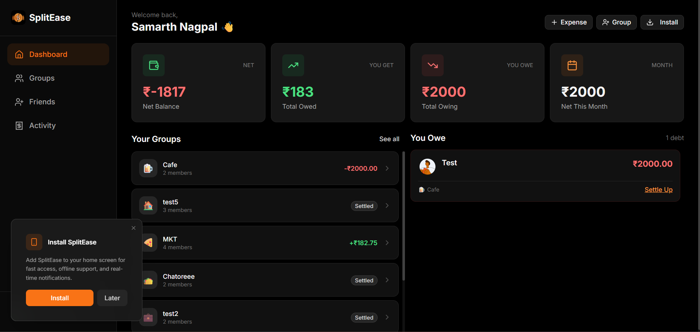
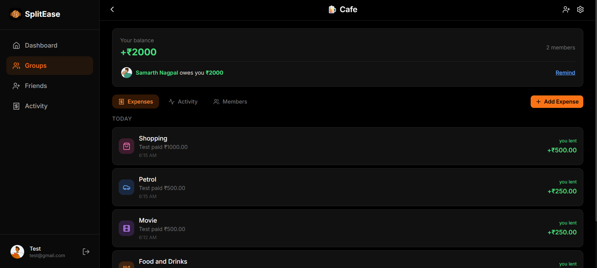
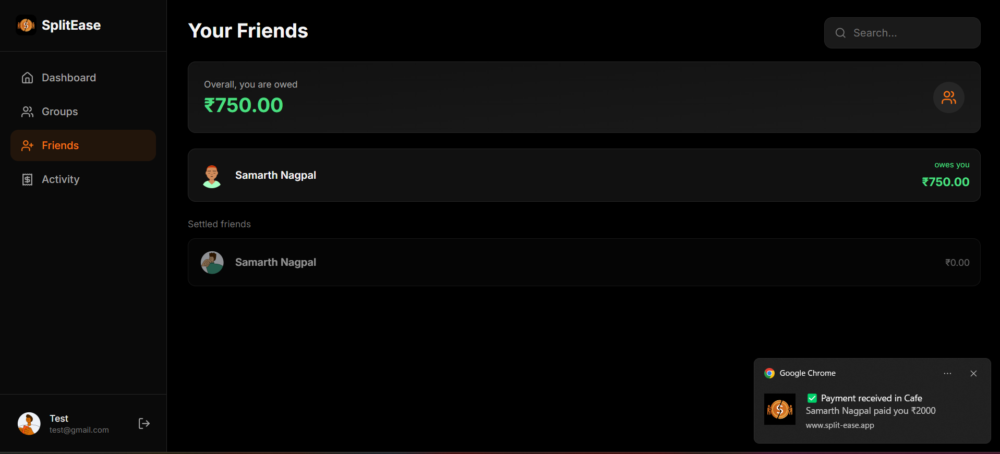
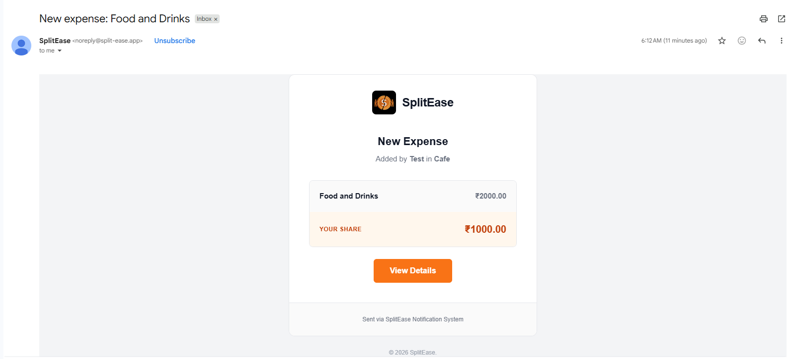
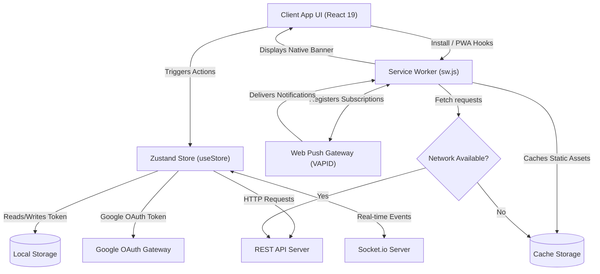

<h1 align="center">
  SplitEase
</h1>

<p align="center">
  <strong>Smart Expense Sharing, Simplified.</strong> A high-performance, real-time Progressive Web App (PWA) built to split bills, track shared group expenses, and settle balances seamlessly with friends.
</p>

<p align="center">
  <a href="https://github.com/Samarth-254/SplitEaseBackend"><strong>SplitEase Backend Repository ➔</strong></a>
</p>

<p align="center">
  
  
  
  
  
</p>

---

## 🎨 User Interface & Screenshots

Here is a visual walkthrough of the client application interfaces:

### 📊 Main Dashboard
Real-time dashboard summarizing total balances, monthly spending, active groups, and quick actions.
<p align="center">
  
</p>

### 👥 Group Details & Bill Split
Detailed group breakdowns, itemized bill-splits, transaction feeds, and settlement options.
<p align="center">
  
</p>

### 🤝 Friends Directory & Web Notifications
Dedicated view to manage individual friend connections and receive real-time web push notification alerts.
<p align="center">
  
</p>

### 📧 Email Notification Service
Configuration dashboard and logs for system transaction emails and reminder updates.
<p align="center">
  
</p>

---

## ✨ Key Features (Frontend Client)

###  1. Core PWA Mechanics
- **Home Screen Installation**: Custom installation triggers (`InstallPrompt`, `InstallInstructionsModal`) offering platform-specific guides for iOS Safari (Add to Home Screen overlay) and Android Chrome (A2HS prompt).
- **Service Worker Lifecycle**: Configured in `sw.js` with background fetch hooks, custom caching strategies (cache-first for static assets, network-first for pages, absolute bypass for REST endpoints/WebSockets).
- **Periodic Update Checker**: Triggers an background check every 30 minutes to alert the client of new application updates without breaking active user workflows.
- **System-Level Integrations**: Custom manifest shortcuts to jump straight to `Add Expense` or `New Group` directly from the OS app icon.

###  2. AI-Powered Category Mapping
- **AI Categorization Integration**: Seamlessly displays AI-detected expense categories fetched from the backend database (e.g. Food & Dining, Travel, Groceries, Utilities).
- **Dynamic Icons & Theme Mapping**: Resolves categories on the client side (`categoryDetection.js`) to corresponding Lucide React icons and custom visual CSS tags (e.g., orange icons for dining, blue for travel).

###  3. Dedicated Friends Management
- **Unified Friends Directory**: Separate dashboard view (`FriendsScreen`) to search, browse, and track all individual friend-to-friend ledgers and pending balances.
- **Settle Up Ledger**: Directly settle debts between you and any specific friend with a custom cash or online settlement flow.
- **Smart Reminders**: Send quick notifications and payment reminders to friends who owe you money with custom tracking modals.

###  4. Real-Time Sync & Communication
- **Socket.io Client Sync**: Event-driven listeners inside the Zustand store automatically update user groups, expense feeds, and settlement records instantly when another member performs an action.
- **Auto-Join Rooms**: Automatically connects the active client to private group-specific and user-specific WebSocket rooms on startup.

###  5. Unified Authentication & Route Security
- **Dual-Mode Sign In**: Supports traditional email/password login as well as one-tap Google OAuth 2.0 integration.
- **Role-Based Routing**: Clean separation of guest and authenticated views (`PublicRoute` vs. `ProtectedRoute`). Initial auth checks render loading skeletons (`DashboardSkeleton`) to eliminate layout shift.

###  6. Global State & Caching Engine
- **State Management (Zustand)**: An atomic client-side store (`useStore`) centralizing complex ledger math (such as calculating debt breakdown metrics).
- **Offline Resilience**: Session storage locks combined with service worker fallbacks allow the interface to serve cached templates during offline connections.

---

## 🛠️ Technology Stack

| Category | Technology | Purpose |
| :--- | :--- | :--- |
| **Core Framework** | React 19.2.0 | High-performance UI rendering and component hierarchy |
| **Build Tooling** | Vite 7.2.4 | Ultra-fast development server and production bundler |
| **State Engine** | Zustand 5.0.9 | Lightweight, boilerplate-free global client-side state store |
| **Real-time Sync** | Socket.io-client 4.8.3 | Persistent WebSocket connection for instant event triggers |
| **Styling & Theme** | Tailwind CSS (CDN/V4) | Responsive dark-mode utility-first styling |
| **Animations** | Framer Motion 12.2.7 | Smooth page transitions and dialog entrance animations |
| **OAuth** | @react-oauth/google | Seamless integration with Google Cloud login services |
| **Push Gateway** | Web Push API | Client-side service worker notification hooks |
| **Analytics** | React GA4 2.1.0 | Analytics telemetry mapping pageviews and user actions |
| **Notifications** | React Hot Toast | Toast messaging system |

---

## 📐 System Architecture Flow

The client app acts as a PWA, interacting with local storage, background service workers, and remote servers:



---

## 📂 Project Structure

Below is the directory mapping of the SplitEase client-side project:

```text
SplitEaseFrontend/
├── public/                     # Static PWA Assets & Workers
│   ├── avatars/                # Default user profile avatars
│   ├── apple-touch-icon.png    # iOS homescreen icons
│   ├── badge-72.png            # Notification badge icons
│   ├── icon-192.png            # Small PWA standard icons
│   ├── icon-512.png            # Large PWA standard icons
│   ├── manifest.json           # PWA metadata, orientations & shortcuts
│   ├── site.webmanifest        # Secondary app manifest
│   └── sw.js                   # Service worker caching and notification hooks
├── src/
│   ├── assets/                 # SVGs and global static assets
│   ├── components/             # Reusable UI & Layout Components
│   │   ├── groups/             # Group specific Modals (e.g. CreateGroupModal)
│   │   ├── layout/             # Main screen frames (Header, Navigation, Screen)
│   │   └── ui/                 # Atomic design components (Avatar, Badge, Button, Input, Modal)
│   ├── screens/                # Main feature screen folders
│   │   ├── activity/           # Recent transaction history feed
│   │   ├── auth/               # Login, Sign Up, and Password Reset screens
│   │   ├── dashboard/          # Central statistics ledger and spend insights
│   │   ├── expense/            # Add Expense modals and input routing
│   │   ├── friends/            # Friend search, invite, and balance details
│   │   ├── groups/             # Group listings and member management
│   │   ├── profile/            # User avatar uploads and account configurations
│   │   └── settle/             # Settle up balance modal flow
│   ├── services/               # Communication wrapper files
│   │   ├── api.js              # Fetch requests controller
│   │   ├── pushNotification.js # Push registration & VAPID keys setup
│   │   └── socket.js           # Socket.io connection initialization
│   ├── store/                  # Global client store
│   │   └── useStore.js         # Unified Zustand store file (1,200+ lines of logic)
│   ├── utils/                  # Heuristic tools and hook utilities
│   │   ├── categoryDetection.js# Keyword scanner for automatic expense tagging
│   │   ├── categoryIcons.js    # Mappings of icons to corresponding categories
│   │   ├── currency.js         # Regional currency formatters
│   │   └── usePWAInstall.js    # Hook tracking install prompt triggers
│   ├── App.css                 # Base application animations
│   ├── App.jsx                 # Routing logic, protected boundaries, and modal listeners
│   ├── index.css               # Base Tailwind theme mappings
│   ├── main.jsx                # React app bootstrapping & SW initializers
│   └── responsive.css          # Mobile safe-area constraints and break-points
├── package.json                # Dependencies and project build scripts
├── vite.config.js              # Vite server config
└── vercel.json                 # Deploy script for client-side hosting redirection
```

---

## ⚙️ Environment Variables

Create a `.env` file at the root of the project to configure the backend links and integrations:

| Variable | Required | Default Value | Description |
| :--- | :---: | :--- | :--- |
| `VITE_API_URL` | Yes | `http://localhost:5000` | The backend Express API address |
| `VITE_VAPID_PUBLIC_KEY` | Yes | *See default key in push service* | The public VAPID key matching the push server key |
| `VITE_GA_MEASUREMENT_ID` | No | - | Google Analytics GA4 Measurement ID |
| `VITE_GOOGLE_CLIENT_ID` | Yes | - | Google Cloud Console OAuth 2.0 Web Client ID |

---

## 🚀 Setup & Installation

Follow these steps to configure the client interface on your local machine:

### 1. Prerequisites
Ensure you have the following tools installed locally:
- [Node.js](https://nodejs.org/en) (v18 or higher recommended)
- [npm](https://www.npmjs.com/) (installed automatically with Node.js)

### 2. Clone and Install Dependencies
Navigate to your workspace directory and install the necessary package dependencies:

```bash
# Clone the repository (if not already downloaded)
git clone https://github.com/your-username/SplitEaseFrontend.git

# Enter the project directory
cd SplitEaseFrontend

# Install all modules
npm install
```

### 3. Spin Up Development Server
Run the local Vite server:

```bash
npm run dev
```
By default, the client app will run at [http://localhost:5173](http://localhost:5173).

### 4. Build for Production
To package the app into optimized, minified static files (HTML, CSS, JS, Assets) ready for hosting:

```bash
npm run build
```
The built files will be located in the `dist/` directory, ready to deploy to providers like Vercel or Netlify.

---

## 📄 License
This project is licensed under the **ISC License**. See the `package.json` file for authorization details.
